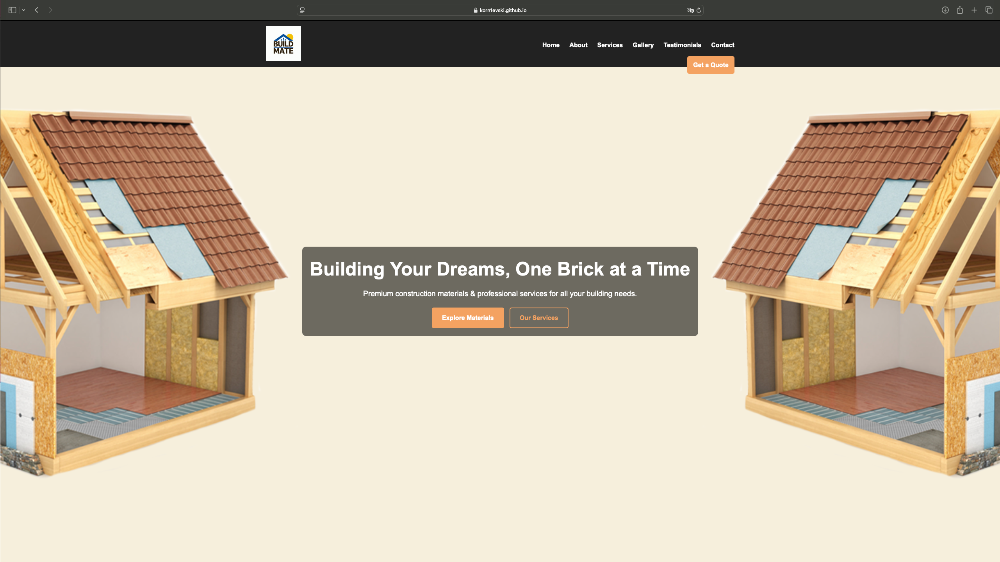
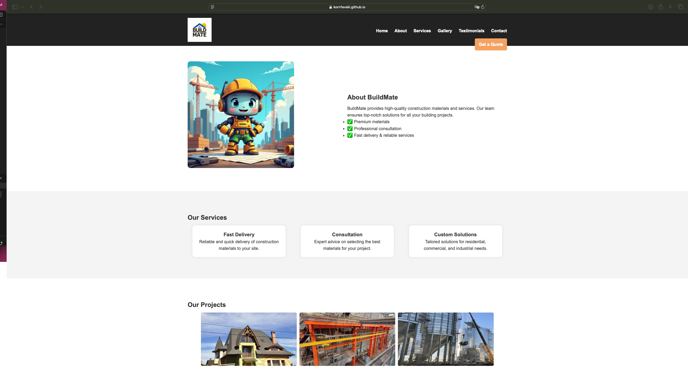

# BuildMate - Construction Materials & Services

Welcome to **BuildMate**, a modern landing page for a construction materials and services company. This project provides a visually appealing and fully responsive website designed to showcase products, services, and testimonials while enabling users to get in touch.

## 🚀 Features

- **Responsive Navigation Bar** with quick access to all sections.
- **Hero Section** with a high-quality background image and clear call-to-action.
- **About Section** presenting the company's mission and values.
- **Services Section** featuring key offerings with icons.
- **Gallery Section** showcasing completed projects.
- **Testimonials Section** displaying customer reviews.
- **Contact Section** with a working form.
- **Footer** containing social media links and additional information.

## 📸 Screenshots

### Hero Section

### Services Section

## 🔗 Live Demo

Check out the deployed site: [BuildMate Live](https://korn1evski.github.io/tum_web_lab2/)

---

**Enjoy building with BuildMate!**
